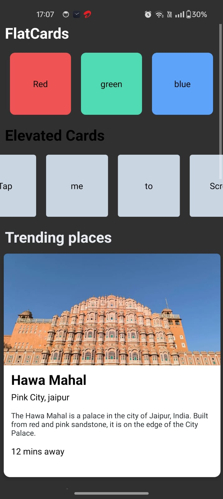
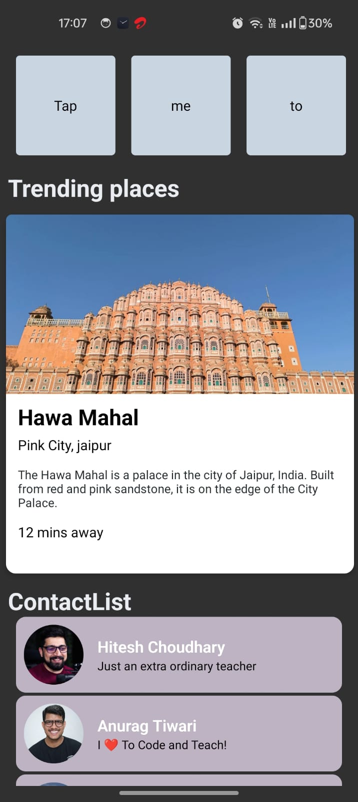
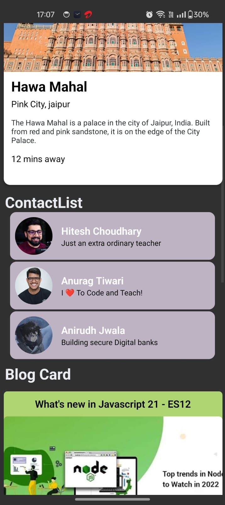
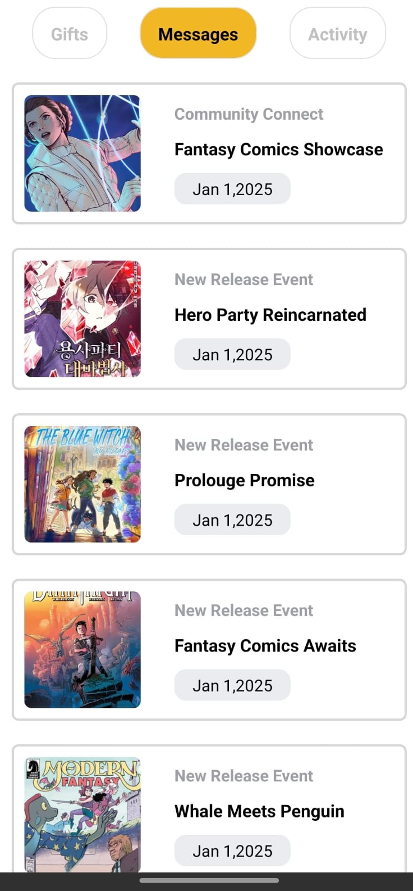

# 🚀 My Awesome App

A React Native learning project exploring UI components and building mini-projects to master React Native development.

## 📌 Project Overview

This repository is structured in two main sections:
1. **🎓 UI Learning** - Components built to learn styling, layouts, and UI patterns
2. **🛠️ Mini-Projects** - Standalone projects focusing on specific features and functionality

---

## 🎓 UI Learning Components

Components created to practice and understand React Native styling and design patterns.

### 1. **FlatCards-ElevatedCards**
Minimalist flat design card without elevation or complex styling.

📁 **Location**: `components/FlatCards.jsx`
📁 **Location**: `components/ElevatedCards.jsx`



---
### 2. **FancyCard**
A stylized card component with shadow effects and gradient backgrounds.

📁 **Location**: `components/FancyCard.jsx`



---

### 3. **ActionCard**
Interactive card component with buttons and click handlers.

📁 **Location**: `components/ActionCard.jsx`


---

### 4. **ContactList**
List-based component demonstrating data iteration and dynamic rendering.

📁 **Location**: `components/ContactList.jsx`



---

### 5. **ComicCard**
Stylized card component for practicing custom text styling and layouts.

📁 **Location**: `components/ComicCard.jsx`



---

## 🛠️ Mini-Projects

Standalone projects built to master specific React Native features and patterns.

---

## 🚀 Getting Started

### Prerequisites
- [Node.js](https://nodejs.org/) installed
- React Native environment set up ([Setup Guide](https://reactnative.dev/docs/set-up-your-environment))

### Step 1: Install Dependencies

```bash
npm install
# or
yarn install
```

### Step 2: Start Metro

```bash
npm start
# or
yarn start
```

### Step 3: Run on Android/iOS

**Android:**
```bash
npm run android
# or
yarn android
```

**iOS:**
```bash
# First time only - install CocoaPods
bundle install
bundle exec pod install

npm run ios
# or
yarn ios
```

---

## 📁 Project Structure

```
MyAwesomeApp/
├── components/                    # UI Learning components
│   ├── FancyCard.jsx
│   ├── ElevatedCards.jsx
│   ├── FlatCards.jsx
│   ├── ActionCard.jsx
│   ├── ContactList.jsx
│   ├── ComicCard.jsx
│   └── Cat.jsx
├── mini-projects/                 # Mini-projects folder
│  
├── screenshots/                   # Component & project screenshots
│   ├── ui-learning/
│   │   ├── fancy-card.png
│   │   ├── elevated-cards.png
│   │   ├── flat-cards.png
│   │   ├── action-card.png
│   │   ├── contact-list.png
│   │   ├── comic-card.png
│   │   └── cat.png
│   └── mini-projects/
│      
├── App.tsx                        # Main app entry point
├── package.json
├── tsconfig.json
└── README.md
```

## 📝 Notes

This is a personal learning repository documenting my journey in React Native development. Each component and project builds upon previous knowledge to develop new skills.

**Status**: 🟢 Active Development  
**Last Updated**: August 31, 2026
